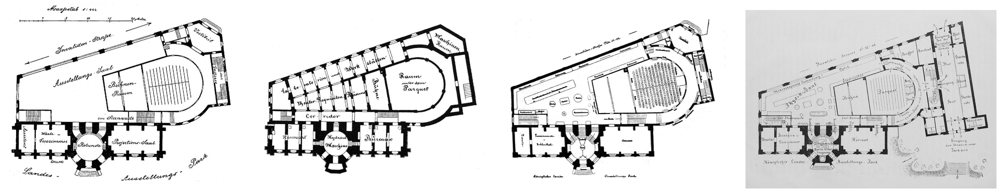

# DHIRET - Digital Humanities Image Retrieval


*Image retrieval of a floor plan. Query image with three retrieved image variations, retrieved by DINO ViT-S/8.*

Welcome to DHIRET, a toolkit associated with our publication, ["Drawing the Line: A Dual Evaluation Approach for Shaping Ground Truth in Image 
Retrieval Using Rich Visual Embeddings of Historical Images"](https://doi.org/10.1145/3604951.3605524). 
This paper is presented at the [7th International Workshop on Historical Document Imaging and Processing](https://blog.sbb.berlin/hip2023/)
on August 26, with the publication anticipated  in the [ ACM Digital Library](https://dl.acm.org/) by the end of August 
or the beginning of September.

## I. Installation

Here, we provide a step-by-step guide for setting up DHIRET on a UNIX-based system, such as Ubuntu, using `conda`. 
If `conda` is not available, alternative environment creation tools like `venv` or `virtualenv` can be used.

### 1. Create venv, virtualenv or conda env

`conda create --name dhiret python=3.8`

### 2. Activate environment

`conda activate dhiret`

### 3. Clone repository

`git clone git@github.com:Madave94/dhiret.git`

### 4. Navigate into repo

`cd dhiret`

### 5. Install PyTorch

Your hardware and OS specifications will determine the exact steps for this process. 
Refer to the official [PyTorch website](https://pytorch.org/) for guidance.

### 6. Install package in editable mode

`pip install -e .`

This action will enable the `dhiret` package importation from any directory. 
If you encounter issues, you may resort to using the legacy `setup.py` as shown below:

`python setupy.py develop`

## II. Data preperation

### 1. Download image classification and retrieval data

There are two datasets that are associated with the repository. The [DHREAAL](https://zenodo.org/record/8070375) and the 
[DHMTIC](https://zenodo.org/record/8069425) dataset. To use the repository as intended you should download these two datasets.

### 2. Store the data

Shift the downloaded datasets into the data folder and extract their contents. 
The subsequent directory structure should appear as follows:
```
data/  
├── dhmtic  
│   ├── all.csv  
│   ├── README.md  
│   ├── test.csv  
│   ├── train.csv  
│   ├── val.csv  
│   ├── test  
│   ├── train  
│   └── val  
└── dhreaal  
    ├── dhreaal.csv  
    ├── README.md  
    └── test  
```

## III. Retrieval on the two existing datasets

The three  models can be compared on the DHREAAL and DHMTIC images after downloading the two datasets. It will use the 
embeddings provided in the `/embeddings` folder. In case you want to do a retrieval on unseen data, that are not part of 
the two datasets, please refer to the section IV.

### 1. Launch Notebook

In the project root folder run:
`jupyter notebook --NotebookApp.tornado_settings='{"websocket_max_message_size": 52428800}`


### 2. Open related notebook

Open for example `CLIP-live.ipynb`. This allows the usage of the retrieval using the jupyter widgets.

## IV. Retrieval on new data

As an example to create new DINO embeddings for retrieval, while still using the jupyter-notebook you can do the following
steps.

### 1. Delete the existing image_name_list.json and index.ann

`rm embeddings/dino_dino_vits8_image_name_list.json embeddings/dino_dino_vits8_index.ann`

Since they will be replaced with your own embeddings, the old ones can be removed.

### 2. Move additional images into `data` folder

The inference script to run in the next step will find all images with the extensions .jpg, .jpeg, .png and .tif in
the `data` folder and it's subfolders. This would mean that new image embeddings are created for DHREAAL, DHMTIC and the
newly added data.

### 3. Run inference script

Now, you can run the inference script from the project root:

`python dhiret/common/inference.py data embeddings dino dino_vits8 --weights_path dino_vits8_epoch9.pth`

This will run the inference on all above specified images in the data folder and save the embeddings into the `embeddings`
folder using the DINO model with a ViTs8 and the trained weights from epoch 9 as used in the paper.

### 4. Use the new embeddings

With the new embeddings you can open the corresponding jupyter-notebook and use it for retrieval. For the provided
example this would be the `DINO-live.ipynb`. You can also use MAML or CLIP instead, by providing the specified arguments.
An overview is available via `python dhiret/common/inference.py --help`.

## V. Training the models and reproducing the results

The training scripts are provided in `scripts` and they represent the configurations used to 
train the models on V100 GPU's.

## VI. Citation
APA7:  
Tschirschwitz, D., Klemstein, F., Schmidgen, H., & Rodehorst, V. (2023, August 25). Drawing the Line: A Dual Evaluation Approach for Shaping Ground Truth in Image Retrieval Using Rich Visual Embeddings of Historical Images. The 7th International Workshop on Historical Document Imaging and Processing. https://doi.org/10.1145/3604951.3605524

BibTex:  
```
@inproceedings{tschirschwitz2023,
	series = {{HIP} '23},
	title = {Drawing the {Line}: {A} {Dual} {Evaluation} {Approach} for {Shaping} {Ground} {Truth} in {Image} {Retrieval} {Using} {Rich} {Visual} {Embeddings} of {Historical} {Images}},
	isbn = {979-8-4007-0841-1/23/08},
	shorttitle = {Drawing the {Line}: {Image} {Retrieval} {Using} {Rich} {Visual} {Embeddings} of {Historical} {Images}},
	doi = {10.1145/3604951.3605524},
	booktitle = {The 7th {International} {Workshop} on {Historical} {Document} {Imaging} and {Processing}},
	publisher = {Association for Computing Machinery},
	author = {Tschirschwitz, David and Klemstein, Franziska and Schmidgen, Henning and Rodehorst, Volker},
	month = aug,
	year = {2023},
}
```